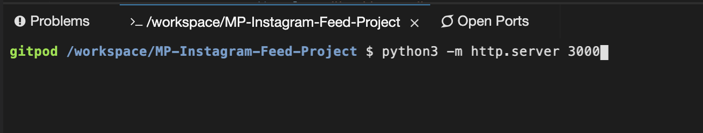

# Bootstrap-Instagram-Feed-Project
  Developed this webpage, simulating a general instagram feed, to gain experience using bootstrap elements intergrated with some javascript functionality.

### Build / Layout
  The project was developed using Bootstrap, JavaScript, JQuery, HTML, CSS, Font Awesome (for the Icons), and Google Fonts (to match the Instagram typography/iconography as closely as possible).
  
  The following image is the example I was supposed to model my work after (the minimum desired result):
  
  

### Final Product
This is my version:

  

## Deployment Instructions (How to Open Project Live)

If you'd like to view the page live in a browser, click the button above; once gitpod loads, run "python3 -m http.server 3000" in the command terminal. Once entered, Gitpod will give you options to view the project; click "Open Browser". A new tab should open up displaying the page. 

  

  

